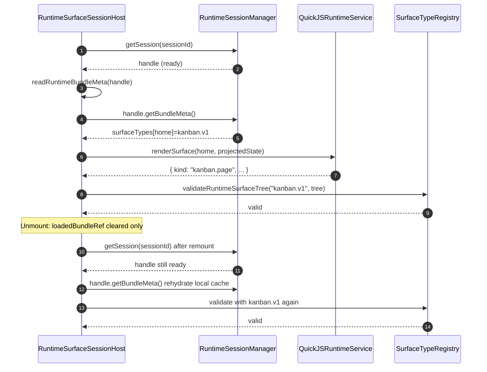

# RuntimeSurfaceSessionHost APP-28 Style Lifecycle Ownership and Strict Pack Resolution Implementation Guide

## Executive Summary

This change applies the APP-28 lifecycle ownership principle to `RuntimeSurfaceSessionHost`: manager-owned runtime state is authoritative, while component-local refs are only caches. The key bug was a remount path where `loadedBundleRef` was empty but the runtime session still existed, causing host pack resolution to degrade into the default UI surface type path.

The fix has two parts:

- Resolve pack IDs from manager-owned runtime metadata on-demand during render (`getSession(sessionId) -> getBundleMeta()`), and cache that metadata in the component ref.
- Remove implicit fallback normalization in `normalizeRuntimeSurfaceTypeId`; missing pack IDs now fail explicitly with a clear runtime error.

This document explains the architecture, sequence, exact file-level changes, tests, and implementation guardrails for intern onboarding.

## Problem Statement

### User-visible symptom

When a user tabs back into a kanban runtime window, the surface can fail with:

- `Runtime render error: root.kind 'kanban.page' is not supported`

This means a valid kanban tree (`kanban.page`) was validated by the wrong surface type validator (`ui.card.v1`), not that the VM tree was malformed.

### Why APP-28 pattern matters here

APP-28 established that runtime lifecycle ownership must be centralized in manager/registry boundaries, not in React host-local mutable state. `RuntimeSurfaceSessionHost` violated that principle by depending on `loadedBundleRef` for type selection in render paths after remount.

## System Context For New Engineers

### Runtime surface rendering pipeline

1. VM defines surfaces and optional pack IDs in QuickJS bootstrap.
2. Runtime service loads bundle and exposes `surfaceTypes` metadata.
3. Runtime session manager stores the bundle metadata for the session.
4. React host fetches rendered tree from runtime handle.
5. Host resolves pack ID and validates tree with the matching runtime surface type registry entry.

### Key architecture boundaries

- VM/QuickJS definition boundary:
  - [stack-bootstrap.vm.js](/home/manuel/workspaces/2026-03-02/os-openai-app-server/wesen-os/workspace-links/go-go-os-frontend/packages/hypercard-runtime/src/plugin-runtime/stack-bootstrap.vm.js:77)
  - [stack-bootstrap.vm.js](/home/manuel/workspaces/2026-03-02/os-openai-app-server/wesen-os/workspace-links/go-go-os-frontend/packages/hypercard-runtime/src/plugin-runtime/stack-bootstrap.vm.js:168)
- Manager lifecycle boundary:
  - [runtimeSessionManager.ts](/home/manuel/workspaces/2026-03-02/os-openai-app-server/wesen-os/workspace-links/go-go-os-frontend/packages/hypercard-runtime/src/runtime-session-manager/runtimeSessionManager.ts:129)
  - [runtimeSessionManager.ts](/home/manuel/workspaces/2026-03-02/os-openai-app-server/wesen-os/workspace-links/go-go-os-frontend/packages/hypercard-runtime/src/runtime-session-manager/runtimeSessionManager.ts:155)
- React host boundary:
  - [RuntimeSurfaceSessionHost.tsx](/home/manuel/workspaces/2026-03-02/os-openai-app-server/wesen-os/workspace-links/go-go-os-frontend/packages/hypercard-runtime/src/runtime-host/RuntimeSurfaceSessionHost.tsx:135)
  - [RuntimeSurfaceSessionHost.tsx](/home/manuel/workspaces/2026-03-02/os-openai-app-server/wesen-os/workspace-links/go-go-os-frontend/packages/hypercard-runtime/src/runtime-host/RuntimeSurfaceSessionHost.tsx:394)
- Surface-type registry boundary:
  - [runtimeSurfaceTypeRegistry.tsx](/home/manuel/workspaces/2026-03-02/os-openai-app-server/wesen-os/workspace-links/go-go-os-frontend/packages/hypercard-runtime/src/runtime-packs/runtimeSurfaceTypeRegistry.tsx:29)

## Root Cause Analysis

### Failure mode before fix

On host remount:

- manager session exists (`getSession(sessionId) !== null`)
- Redux session status remains `ready`
- component `loadedBundleRef.current` is null after unmount cleanup

Old render path resolved pack ID via local ref and default normalization. If local metadata was empty, host implicitly used `ui.card.v1`, then UI schema rejected `kanban.page`.

- old local ref dependency area: [RuntimeSurfaceSessionHost.tsx](/home/manuel/workspaces/2026-03-02/os-openai-app-server/wesen-os/workspace-links/go-go-os-frontend/packages/hypercard-runtime/src/runtime-host/RuntimeSurfaceSessionHost.tsx:135)
- validator error source: [uiSchema.ts](/home/manuel/workspaces/2026-03-02/os-openai-app-server/wesen-os/workspace-links/go-go-os-frontend/packages/ui-runtime/src/runtime-packs/uiSchema.ts:229)

### Ownership mismatch

The host treated manager state and local ref as peer sources of truth. APP-28 says they are not peers:

- manager state is source of truth
- local React refs are cache artifacts and may be dropped on unmount

## Proposed Solution

### Design goals

- Keep runtime session lifecycle ownership in manager boundaries.
- Make pack resolution deterministic and remount-safe.
- Fail explicitly when pack metadata is missing.
- Keep existing runtime surface injection precedence.

### Concrete changes

1. `localRuntimeReady` now derives only from manager session presence.
  - [RuntimeSurfaceSessionHost.tsx](/home/manuel/workspaces/2026-03-02/os-openai-app-server/wesen-os/workspace-links/go-go-os-frontend/packages/hypercard-runtime/src/runtime-host/RuntimeSurfaceSessionHost.tsx:137)
2. Add `readRuntimeBundleMeta(runtimeHandle)` to lazily hydrate local cache from manager-owned session metadata.
  - [RuntimeSurfaceSessionHost.tsx](/home/manuel/workspaces/2026-03-02/os-openai-app-server/wesen-os/workspace-links/go-go-os-frontend/packages/hypercard-runtime/src/runtime-host/RuntimeSurfaceSessionHost.tsx:139)
3. Add `resolveSurfacePackId(surfaceId, runtimeHandle)` with deterministic precedence:
  - pending runtime surface registry packId (if present)
  - runtime bundle `surfaceTypes[surfaceId]` from hydrated metadata
  - else explicit failure through strict normalization
  - [RuntimeSurfaceSessionHost.tsx](/home/manuel/workspaces/2026-03-02/os-openai-app-server/wesen-os/workspace-links/go-go-os-frontend/packages/hypercard-runtime/src/runtime-host/RuntimeSurfaceSessionHost.tsx:158)
4. Refactor render memo to compute `{ tree, packId, error }` once and reuse in final render.
  - [RuntimeSurfaceSessionHost.tsx](/home/manuel/workspaces/2026-03-02/os-openai-app-server/wesen-os/workspace-links/go-go-os-frontend/packages/hypercard-runtime/src/runtime-host/RuntimeSurfaceSessionHost.tsx:394)
5. Remove implicit default in `normalizeRuntimeSurfaceTypeId`.
  - [runtimeSurfaceTypeRegistry.tsx](/home/manuel/workspaces/2026-03-02/os-openai-app-server/wesen-os/workspace-links/go-go-os-frontend/packages/hypercard-runtime/src/runtime-packs/runtimeSurfaceTypeRegistry.tsx:29)

### Pseudocode

```ts
function resolveSurfacePackId(surfaceId, runtimeHandle) {
  const injected = findPendingSurface(surfaceId)?.packId;
  if (injected) return normalizeRuntimeSurfaceTypeId(injected);

  const bundleMeta = readRuntimeBundleMeta(runtimeHandle); // cache-aware manager read
  const declaredPack = bundleMeta?.surfaceTypes?.[surfaceId];

  // strict: throws when missing/blank
  return normalizeRuntimeSurfaceTypeId(declaredPack);
}

function renderOutcome() {
  if (!sessionReadyInRedux || !managerHasSession) return { tree: null, packId: null, error: null };

  try {
    const handle = manager.getSession(sessionId);
    const packId = resolveSurfacePackId(surfaceId, handle);
    const rawTree = handle.renderSurface(surfaceId, projectedState);
    const tree = rawTree == null ? null : validateRuntimeSurfaceTree(packId, rawTree);
    return { tree, packId, error: null };
  } catch (err) {
    return { tree: null, packId: null, error: String(err) };
  }
}
```

## Time Sequence (Mount / Unmount / Remount)



## Implementation Plan

### Phase 1: Host lifecycle ownership alignment

- Implement manager-first readiness and metadata rehydration:
  - [RuntimeSurfaceSessionHost.tsx](/home/manuel/workspaces/2026-03-02/os-openai-app-server/wesen-os/workspace-links/go-go-os-frontend/packages/hypercard-runtime/src/runtime-host/RuntimeSurfaceSessionHost.tsx:137)
  - [RuntimeSurfaceSessionHost.tsx](/home/manuel/workspaces/2026-03-02/os-openai-app-server/wesen-os/workspace-links/go-go-os-frontend/packages/hypercard-runtime/src/runtime-host/RuntimeSurfaceSessionHost.tsx:139)
- Keep unmount cleanup (`loadedBundleRef = null`) unchanged, because ref is now cache-only and remount-safe:
  - [RuntimeSurfaceSessionHost.tsx](/home/manuel/workspaces/2026-03-02/os-openai-app-server/wesen-os/workspace-links/go-go-os-frontend/packages/hypercard-runtime/src/runtime-host/RuntimeSurfaceSessionHost.tsx:359)

### Phase 2: Strict pack id semantics

- Change normalizer from "missing -> ui.card.v1" to explicit throw:
  - [runtimeSurfaceTypeRegistry.tsx](/home/manuel/workspaces/2026-03-02/os-openai-app-server/wesen-os/workspace-links/go-go-os-frontend/packages/hypercard-runtime/src/runtime-packs/runtimeSurfaceTypeRegistry.tsx:29)
- Add regression assertions for missing-id behavior:
  - [runtimeSurfaceTypeRegistry.test.tsx](/home/manuel/workspaces/2026-03-02/os-openai-app-server/wesen-os/workspace-links/go-go-os-frontend/packages/hypercard-runtime/src/runtime-packs/runtimeSurfaceTypeRegistry.test.tsx:58)

### Phase 3: Non-default pack remount test coverage

- Extend mock runtime service to return `kanban.v1` + `kanban.page` for dedicated session IDs:
  - [RuntimeSurfaceSessionHost.rerender.test.tsx](/home/manuel/workspaces/2026-03-02/os-openai-app-server/wesen-os/workspace-links/go-go-os-frontend/packages/hypercard-runtime/src/runtime-host/RuntimeSurfaceSessionHost.rerender.test.tsx:17)
- Add explicit remount test proving metadata rehydration from manager without runtime error:
  - [RuntimeSurfaceSessionHost.rerender.test.tsx](/home/manuel/workspaces/2026-03-02/os-openai-app-server/wesen-os/workspace-links/go-go-os-frontend/packages/hypercard-runtime/src/runtime-host/RuntimeSurfaceSessionHost.rerender.test.tsx:348)

## Design Decisions

- Decision: manager session metadata is authoritative after remount.
  - Rationale: component refs are not lifecycle-stable.
- Decision: strict failure on missing surface type id.
  - Rationale: implicit fallback hides metadata integrity bugs and can route trees into wrong validator.
- Decision: resolve pack once per render memo and carry `packId` to final JSX render.
  - Rationale: avoid divergence between validation and rendering paths.

## Alternatives Considered

1. Keep default fallback to `ui.card.v1` and only add logs.
- Rejected because it preserves wrong-type rendering and keeps latent data-integrity bugs silent.

2. Force host reload on every remount to repopulate local ref.
- Rejected because it adds unnecessary session churn and violates manager ownership model.

3. Persist local ref in module-global cache.
- Rejected because it creates duplicate ownership and stale cache invalidation complexity.

## Validation Strategy

### Automated tests

Run targeted runtime tests:

```bash
npm run test -w packages/hypercard-runtime -- \
  src/runtime-host/RuntimeSurfaceSessionHost.rerender.test.tsx \
  src/runtime-packs/runtimeSurfaceTypeRegistry.test.tsx
```

Expected outcomes:

- New remount regression test passes for `kanban.v1` with no `root.kind` unsupported error.
- Normalizer tests fail when pack id is missing/blank.

### Manual smoke checks

- Open `Personal Planner` kanban runtime window.
- Switch tabs/windows to trigger host unmount/remount behavior.
- Confirm no runtime render error toast for `kanban.page` mismatch.

## Risks And Mitigations

- Risk: upstream VM paths still emit default `ui.card.v1` for missing pack IDs.
  - Mitigation: strict host normalization now makes missing IDs visible where they leak into host resolution.
- Risk: other consumers may still use explicit local fallbacks (`?? 'ui.card.v1'`) outside this path.
  - Mitigation: follow-up audit suggested for REPL and diagnostics paths.

## Open Questions

- Should VM bootstrap also become strict for missing `packId` instead of defaulting at definition time?
- Should runtime host include a machine-readable telemetry event when `normalizeRuntimeSurfaceTypeId` throws?

## API References

- `RuntimeSurfaceSessionHost` helpers:
  - `readRuntimeBundleMeta(runtimeHandle)`
  - `resolveSurfacePackId(surfaceId, runtimeHandle)`
- `runtimeSurfaceTypeRegistry`:
  - `normalizeRuntimeSurfaceTypeId(packId?: string | null): string`
  - `validateRuntimeSurfaceTree(packId: string | undefined, value: unknown)`
- `runtimeSessionManager`:
  - `getSession(sessionId)`
  - `RuntimeSessionManagerHandle.getBundleMeta()`
  - `RuntimeSessionManagerHandle.attachView(viewId)`

## References

- [RuntimeSurfaceSessionHost.tsx](/home/manuel/workspaces/2026-03-02/os-openai-app-server/wesen-os/workspace-links/go-go-os-frontend/packages/hypercard-runtime/src/runtime-host/RuntimeSurfaceSessionHost.tsx:137)
- [runtimeSurfaceTypeRegistry.tsx](/home/manuel/workspaces/2026-03-02/os-openai-app-server/wesen-os/workspace-links/go-go-os-frontend/packages/hypercard-runtime/src/runtime-packs/runtimeSurfaceTypeRegistry.tsx:29)
- [RuntimeSurfaceSessionHost.rerender.test.tsx](/home/manuel/workspaces/2026-03-02/os-openai-app-server/wesen-os/workspace-links/go-go-os-frontend/packages/hypercard-runtime/src/runtime-host/RuntimeSurfaceSessionHost.rerender.test.tsx:348)
- [runtimeSessionManager.ts](/home/manuel/workspaces/2026-03-02/os-openai-app-server/wesen-os/workspace-links/go-go-os-frontend/packages/hypercard-runtime/src/runtime-session-manager/runtimeSessionManager.ts:129)
- [stack-bootstrap.vm.js](/home/manuel/workspaces/2026-03-02/os-openai-app-server/wesen-os/workspace-links/go-go-os-frontend/packages/hypercard-runtime/src/plugin-runtime/stack-bootstrap.vm.js:77)
- [uiSchema.ts](/home/manuel/workspaces/2026-03-02/os-openai-app-server/wesen-os/workspace-links/go-go-os-frontend/packages/ui-runtime/src/runtime-packs/uiSchema.ts:229)
