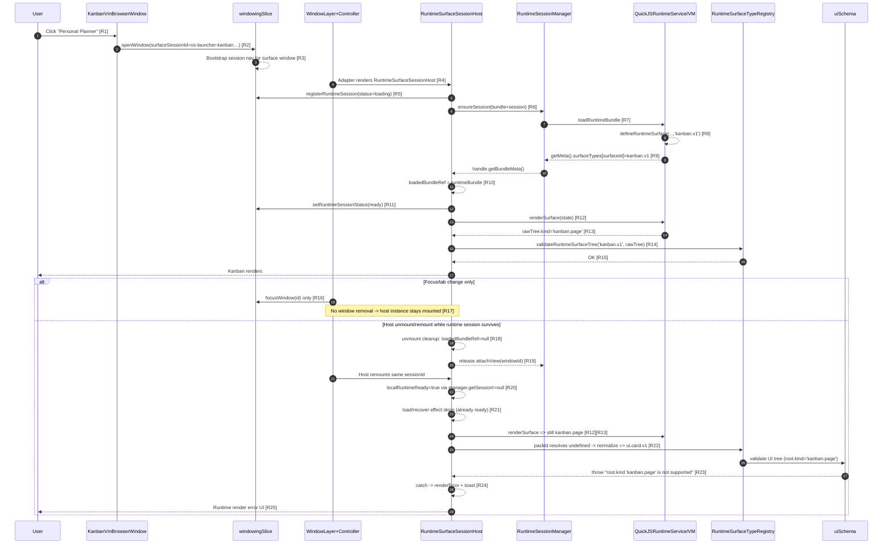

# Kanban Personal Planner Runtime Error Time Sequence

## Goal

Show the exact click-to-error sequence for `Personal Planner`, with explicit mount/unmount/remount behavior and file+line anchors.

## Context

This sequence starts at the button click in `kanbanVmModule.tsx`, follows runtime session creation and first successful render, then branches into:

1. Focus switch only (no unmount, usually no error)
2. Host remount with surviving runtime session (error path)

## Quick Reference

## File + Line References

- `[R1]` `Personal Planner` button render/click
  - [kanbanVmModule.tsx](/home/manuel/workspaces/2026-03-02/os-openai-app-server/wesen-os/apps/os-launcher/src/app/kanbanVmModule.tsx:124)
- `[R2]` Button dispatch to `openWindow` with generated `surfaceSessionId`
  - [kanbanVmModule.tsx](/home/manuel/workspaces/2026-03-02/os-openai-app-server/wesen-os/apps/os-launcher/src/app/kanbanVmModule.tsx:74)
  - [kanbanVmModule.tsx](/home/manuel/workspaces/2026-03-02/os-openai-app-server/wesen-os/apps/os-launcher/src/app/kanbanVmModule.tsx:129)
- `[R3]` Window state creates surface nav session on open
  - [windowingSlice.ts](/home/manuel/workspaces/2026-03-02/os-openai-app-server/wesen-os/workspace-links/go-go-os-frontend/packages/engine/src/desktop/core/state/windowingSlice.ts:65)
- `[R4]` Surface window adapter renders `RuntimeSurfaceSessionHost`
  - [kanbanVmModule.tsx](/home/manuel/workspaces/2026-03-02/os-openai-app-server/wesen-os/apps/os-launcher/src/app/kanbanVmModule.tsx:92)
  - [kanbanVmModule.tsx](/home/manuel/workspaces/2026-03-02/os-openai-app-server/wesen-os/apps/os-launcher/src/app/kanbanVmModule.tsx:107)
  - [WindowLayer.tsx](/home/manuel/workspaces/2026-03-02/os-openai-app-server/wesen-os/workspace-links/go-go-os-frontend/packages/engine/src/components/shell/windowing/WindowLayer.tsx:96)
- `[R5]` Host registers runtime session in Redux
  - [RuntimeSurfaceSessionHost.tsx](/home/manuel/workspaces/2026-03-02/os-openai-app-server/wesen-os/workspace-links/go-go-os-frontend/packages/hypercard-runtime/src/runtime-host/RuntimeSurfaceSessionHost.tsx:150)
- `[R6]` Host requests runtime session handle
  - [RuntimeSurfaceSessionHost.tsx](/home/manuel/workspaces/2026-03-02/os-openai-app-server/wesen-os/workspace-links/go-go-os-frontend/packages/hypercard-runtime/src/runtime-host/RuntimeSurfaceSessionHost.tsx:186)
  - [runtimeSessionManager.ts](/home/manuel/workspaces/2026-03-02/os-openai-app-server/wesen-os/workspace-links/go-go-os-frontend/packages/hypercard-runtime/src/runtime-session-manager/runtimeSessionManager.ts:193)
- `[R7]` Runtime service loads VM session/bundle
  - [runtimeService.ts](/home/manuel/workspaces/2026-03-02/os-openai-app-server/wesen-os/workspace-links/go-go-os-frontend/packages/hypercard-runtime/src/plugin-runtime/runtimeService.ts:162)
- `[R8]` VM surface authored as `kanban.v1`
  - [kanbanPersonalPlanner.vm.js](/home/manuel/workspaces/2026-03-02/os-openai-app-server/wesen-os/apps/os-launcher/src/domain/vm/cards/kanbanPersonalPlanner.vm.js:26)
  - [stack-bootstrap.vm.js](/home/manuel/workspaces/2026-03-02/os-openai-app-server/wesen-os/workspace-links/go-go-os-frontend/packages/hypercard-runtime/src/plugin-runtime/stack-bootstrap.vm.js:118)
- `[R9]` VM meta exposes `surfaceTypes`
  - [stack-bootstrap.vm.js](/home/manuel/workspaces/2026-03-02/os-openai-app-server/wesen-os/workspace-links/go-go-os-frontend/packages/hypercard-runtime/src/plugin-runtime/stack-bootstrap.vm.js:168)
- `[R10]` Host stores bundle meta in `loadedBundleRef`
  - [RuntimeSurfaceSessionHost.tsx](/home/manuel/workspaces/2026-03-02/os-openai-app-server/wesen-os/workspace-links/go-go-os-frontend/packages/hypercard-runtime/src/runtime-host/RuntimeSurfaceSessionHost.tsx:195)
- `[R11]` Host marks session ready
  - [RuntimeSurfaceSessionHost.tsx](/home/manuel/workspaces/2026-03-02/os-openai-app-server/wesen-os/workspace-links/go-go-os-frontend/packages/hypercard-runtime/src/runtime-host/RuntimeSurfaceSessionHost.tsx:198)
- `[R12]` Host requests runtime render
  - [RuntimeSurfaceSessionHost.tsx](/home/manuel/workspaces/2026-03-02/os-openai-app-server/wesen-os/workspace-links/go-go-os-frontend/packages/hypercard-runtime/src/runtime-host/RuntimeSurfaceSessionHost.tsx:384)
  - [runtimeService.ts](/home/manuel/workspaces/2026-03-02/os-openai-app-server/wesen-os/workspace-links/go-go-os-frontend/packages/hypercard-runtime/src/plugin-runtime/runtimeService.ts:282)
- `[R13]` Kanban VM returns `widgets.kanban.page` root
  - [00-runtimePrelude.vm.js](/home/manuel/workspaces/2026-03-02/os-openai-app-server/wesen-os/apps/os-launcher/src/domain/vm/00-runtimePrelude.vm.js:427)
- `[R14]` Host validates tree against selected pack
  - [RuntimeSurfaceSessionHost.tsx](/home/manuel/workspaces/2026-03-02/os-openai-app-server/wesen-os/workspace-links/go-go-os-frontend/packages/hypercard-runtime/src/runtime-host/RuntimeSurfaceSessionHost.tsx:383)
  - [runtimeSurfaceTypeRegistry.tsx](/home/manuel/workspaces/2026-03-02/os-openai-app-server/wesen-os/workspace-links/go-go-os-frontend/packages/hypercard-runtime/src/runtime-packs/runtimeSurfaceTypeRegistry.tsx:51)
- `[R15]` Kanban validator expects `kanban.page`
  - [kanbanV1Pack.tsx](/home/manuel/workspaces/2026-03-02/os-openai-app-server/wesen-os/workspace-links/go-go-os-frontend/packages/kanban-runtime/src/runtime-packs/kanbanV1Pack.tsx:489)
- `[R16]` Focus change is `focusWindow` (not close)
  - [useDesktopShellController.tsx](/home/manuel/workspaces/2026-03-02/os-openai-app-server/wesen-os/workspace-links/go-go-os-frontend/packages/engine/src/components/shell/windowing/useDesktopShellController.tsx:616)
- `[R17]` Window body cache signature excludes focus state
  - [useDesktopShellController.tsx](/home/manuel/workspaces/2026-03-02/os-openai-app-server/wesen-os/workspace-links/go-go-os-frontend/packages/engine/src/components/shell/windowing/useDesktopShellController.tsx:111)
  - [useDesktopShellController.tsx](/home/manuel/workspaces/2026-03-02/os-openai-app-server/wesen-os/workspace-links/go-go-os-frontend/packages/engine/src/components/shell/windowing/useDesktopShellController.tsx:1143)
- `[R18]` Host unmount cleanup zeros `loadedBundleRef`
  - [RuntimeSurfaceSessionHost.tsx](/home/manuel/workspaces/2026-03-02/os-openai-app-server/wesen-os/workspace-links/go-go-os-frontend/packages/hypercard-runtime/src/runtime-host/RuntimeSurfaceSessionHost.tsx:333)
- `[R19]` `attachView` release path
  - [RuntimeSurfaceSessionHost.tsx](/home/manuel/workspaces/2026-03-02/os-openai-app-server/wesen-os/workspace-links/go-go-os-frontend/packages/hypercard-runtime/src/runtime-host/RuntimeSurfaceSessionHost.tsx:330)
  - [runtimeSessionManager.ts](/home/manuel/workspaces/2026-03-02/os-openai-app-server/wesen-os/workspace-links/go-go-os-frontend/packages/hypercard-runtime/src/runtime-session-manager/runtimeSessionManager.ts:129)
- `[R20]` Host treats manager session presence as local readiness
  - [RuntimeSurfaceSessionHost.tsx](/home/manuel/workspaces/2026-03-02/os-openai-app-server/wesen-os/workspace-links/go-go-os-frontend/packages/hypercard-runtime/src/runtime-host/RuntimeSurfaceSessionHost.tsx:137)
- `[R21]` Load/recover effect short-circuit condition
  - [RuntimeSurfaceSessionHost.tsx](/home/manuel/workspaces/2026-03-02/os-openai-app-server/wesen-os/workspace-links/go-go-os-frontend/packages/hypercard-runtime/src/runtime-host/RuntimeSurfaceSessionHost.tsx:165)
  - [RuntimeSurfaceSessionHost.tsx](/home/manuel/workspaces/2026-03-02/os-openai-app-server/wesen-os/workspace-links/go-go-os-frontend/packages/hypercard-runtime/src/runtime-host/RuntimeSurfaceSessionHost.tsx:168)
- `[R22]` Missing pack resolves to default `ui.card.v1`
  - [RuntimeSurfaceSessionHost.tsx](/home/manuel/workspaces/2026-03-02/os-openai-app-server/wesen-os/workspace-links/go-go-os-frontend/packages/hypercard-runtime/src/runtime-host/RuntimeSurfaceSessionHost.tsx:383)
  - [runtimeSurfaceTypeRegistry.tsx](/home/manuel/workspaces/2026-03-02/os-openai-app-server/wesen-os/workspace-links/go-go-os-frontend/packages/hypercard-runtime/src/runtime-packs/runtimeSurfaceTypeRegistry.tsx:29)
- `[R23]` UI schema unsupported root-kind throw
  - [uiSchema.ts](/home/manuel/workspaces/2026-03-02/os-openai-app-server/wesen-os/workspace-links/go-go-os-frontend/packages/ui-runtime/src/runtime-packs/uiSchema.ts:229)
- `[R24]` Host catches and stores `renderError`; emits toast
  - [RuntimeSurfaceSessionHost.tsx](/home/manuel/workspaces/2026-03-02/os-openai-app-server/wesen-os/workspace-links/go-go-os-frontend/packages/hypercard-runtime/src/runtime-host/RuntimeSurfaceSessionHost.tsx:389)
  - [RuntimeSurfaceSessionHost.tsx](/home/manuel/workspaces/2026-03-02/os-openai-app-server/wesen-os/workspace-links/go-go-os-frontend/packages/hypercard-runtime/src/runtime-host/RuntimeSurfaceSessionHost.tsx:401)
- `[R25]` Error UI text rendered
  - [RuntimeSurfaceSessionHost.tsx](/home/manuel/workspaces/2026-03-02/os-openai-app-server/wesen-os/workspace-links/go-go-os-frontend/packages/hypercard-runtime/src/runtime-host/RuntimeSurfaceSessionHost.tsx:476)

## Usage Examples

- Debugging remount crashes: follow the `else` branch and verify whether `loadedBundleRef` is null while manager session exists.
- Validating a fix: ensure pack resolution at `[R22]` no longer falls back to `ui.card.v1` for `kanbanPersonalPlanner` after remount.
- Explaining behavior to new engineers: use this sequence alongside the design doc in `design-doc/01-...`.
